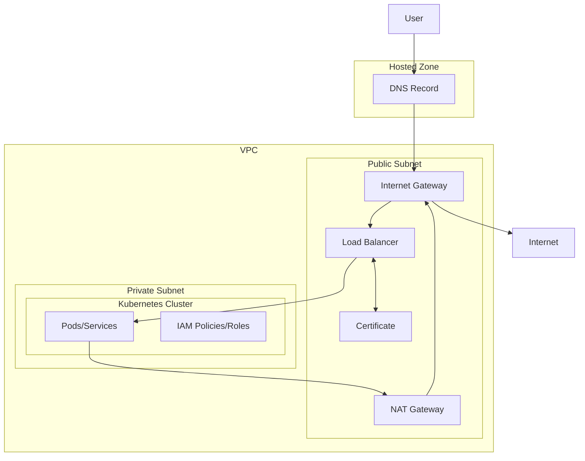

# Public Cluster

This module creates a public Kubernetes cluster in AWS using EKS. The cluster is designed to be accessible from the public internet, with public-facing load balancers and other resources.

The following diagram illustrates the resources created by this module, and how they interact with one another

